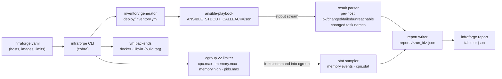

# infraforge


infraforge is a Go CLI that provisions multi-node infrastructure with
idempotent Ansible playbooks and enforces per-workload CPU/memory limits with
Linux cgroups v2. `provision` turns a declarative YAML config into a set of
Docker-backed nodes (image, SSH, base packages, a supervisor-managed burner
workload) and verifies the result; `limit` runs any command inside a
cgroup v2 sandbox and reports whether it was throttled or OOM-killed;
`vm` manages virtual machines through pluggable backends; `report` renders
machine-readable per-run summaries (`reports/<run_id>.json`) of everything
above.

## Architecture



## Quickstart

Prerequisites: Linux with the cgroups v2 unified hierarchy (`/sys/fs/cgroup/cgroup.controllers`
exists), Docker, Ansible 2.16+, Go 1.22+, `sshpass`, and the pinned Ansible
collections plus the Docker SDK for the control node:

```sh
ansible-galaxy install -r deploy/requirements.yml   # community.docker, community.general
python3 -m pip install docker                       # SDK used by the docker modules
make build
```

Provision once, then again — the second run must be a no-op:

```sh
$ ./bin/infraforge provision
... 10 tasks changed on the first run ...

$ ./bin/infraforge provision
level=INFO msg="provisioning complete" hosts=3 changed_tasks=0 changed_task_names=[]

$ ./bin/infraforge report
```

Then try the cgroups demo:

```sh
go build -o bin/burner ./hack
./bin/infraforge limit --name demo-oom --memory-max 256M -- ./bin/burner -mem-mb 512 -cpu 0
./bin/infraforge limit --name demo-cpu --cpu-max 25% -- ./bin/burner -mem-mb 32 -cpu 2 -duration 15s
```

See `docs/demo-cgroups.md` for the full captured run.

## Sample output

First provision (creates everything; every host reports changes):

```
$ ./bin/infraforge provision
level=INFO msg="provisioning complete" hosts=3 changed_tasks=10 changed_task_names="[
  Build the node container image
  Ensure node containers are running
  base : Install base packages
  base : Ensure the node config directory exists
  base : Render node configuration
  workload : Install supervisor
  workload : Deploy the CPU and memory burner script
  workload : Configure the burner program
  workload : Ensure supervisord is running
  workload : Restart burner]"
```

Second provision (fully idempotent):

```
$ ./bin/infraforge provision
level=INFO msg="provisioning complete" hosts=3 changed_tasks=0 changed_task_names=[]

$ ./bin/infraforge report
provision bf0ba61e-3e55-4e14-be79-ace1c01be914 (wall time 9.1s)
  hosts provisioned: 3
  per-host task counts:
    db-01            ok=10  changed=0   failed=0   unreachable=0
    localhost        ok=2   changed=0   failed=0   unreachable=0
    web-01           ok=10  changed=0   failed=0   unreachable=0
  tasks that changed state (0):
    (none)
```

OOM enforcement (256M cap, burner allocates 512M; exit code 3 = limit
violation):

```
$ ./bin/infraforge limit --name demo-oom --memory-max 256M -- ./bin/burner -mem-mb 512 -cpu 0
burner: allocated 64 MiB
burner: allocated 128 MiB
burner: allocated 192 MiB
burner: allocated 256 MiB
limit summary
  cgroup:   /sys/fs/cgroup/infraforge/demo-oom
  command:  ./bin/burner -mem-mb 512 -cpu 0
  exit:     signal: killed
  cpu:      throttled_usec=0
  memory:   current=204800 peak=268435456 oom_kill=1 high_events=0
  verdict:  oom-killed
$ echo $?
3
```

CPU enforcement shows a rising `throttled_usec` under a 25% cap — captured in
`docs/demo-cgroups.md`.

## Commands

| Command | Arguments | What it does |
| --- | --- | --- |
| `provision` | — | Loads the config, generates `deploy/inventory.yml`, runs the site playbook, writes `reports/<run_id>.json`. `--dry-run` maps to `ansible-playbook --check --diff`. |
| `limit` | `-- <command...>` | Creates `/sys/fs/cgroup/infraforge/<name>`, applies limits, forks the command into it, samples stats, reports throttle/OOM. |
| `vm start` | `<name>` | Starts the VM for a config host (image from config). |
| `vm stop` | `<name>` | Stops the VM. |
| `vm inspect` | `<name>` | Shows state, PID, and namespace IDs from `/proc/<pid>/ns/*`. |
| `vm list` | — | Lists VMs managed by the backend. |
| `report` | — | Prints a summary of the most recent provision and limit runs. |

## Flags

| Flag | Scope | Default | Description |
| --- | --- | --- | --- |
| `--config` | global | `infraforge.yaml` | Config file path. |
| `--inventory` | global | `deploy/inventory.yml` | Inventory path (generated; do not hand-edit). |
| `--reports-dir` | global | `reports` | Where run reports are written/read. |
| `--dry-run` | global | `false` | Provision: run ansible in `--check --diff`. |
| `--log-format` | global | `text` | `text` or `json`; every line carries `run_id`. |
| `--name` | limit (required) | — | Cgroup name. |
| `--cpu-max` | limit | unset | CPU share of one core, e.g. `25%`. |
| `--memory-max` | limit | unset | Memory cap as a byte string, e.g. `256M`. |
| `--pids-max` | limit | `0` | Process count cap (0 = unlimited). |
| `--backend` | vm | auto | `docker`, `libvirt`, or auto-detect. |
| `--format` | report | `table` | `table` or `json`. |

## Exit codes

| Code | Meaning |
| --- | --- |
| `0` | Success. |
| `1` | Provision failure: ansible exec/parse errors, failed or unreachable hosts, unsupported platform, unknown commands. |
| `2` | Config error: unparsable/invalid config file, unknown host, or invalid configuring flags (`--cpu-max`, `--memory-max`, `--format`). |
| `3` | Limit violation: the limited command was OOM-killed or exited non-zero. |

## Design notes

- **cgroups v2 unified hierarchy, not v1.** One mount, one accounting path;
  no per-controller mounts (`/sys/fs/cgroup/cpu`, `/memory`, ...). It exposes
  `memory.high` (throttle before kill), `memory.peak` (post-mortem peak for
  OOM forensics), and `cpu.max` as a clean quota/period pair. v1 is frozen by
  the kernel and absent from modern distros. See `docs/cgroups.md` for every
  file written and read.
- **Ansible JSON stdout callback, not text scraping.** The playbook runs with
  `ANSIBLE_STDOUT_CALLBACK=json`; the Go side streams newline-delimited JSON
  documents into typed structs — per-host `ok`/`changed`/`unreachable`/
  `failures` plus the names of tasks that reported `changed: true`. Every
  task transition is logged through `slog`, and the same parser is unit-tested
  against recorded fixtures in `testdata/ansible/` with no Ansible required.
- **Idempotency is enforced by construction, then proven by test.** The
  playbook only uses convergent modules (`state: present`, template/copy
  checksums, `apt` with `cache_valid_time`, `docker_image` build-arg
  comparison, `docker_container` config comparison, `supervisorctl` state
  checks, handlers notified only on change) — no bare `command:`/`shell:`.
  `test/integration/idempotency_test.go` provisions twice against real Docker
  nodes and fails if run 2 reports `changed != 0` for any host, printing the
  offending task names; it also asserts the generated inventory is
  byte-identical across runs.
- **Namespace isolation is observable, not assumed.** `vm inspect` reads
  `/proc/<pid>/ns/*` and reports the PID, UTS, and network namespace IDs of
  each VM, proving kernel-level separation rather than trusting the runtime.
- **Every run is machine-readable.** `provision` and `limit` write
  `reports/<run_id>.json`; `report` aggregates them, and CI uploads them as
  artifacts. The `run_id` (UUID v4) on every log line joins a run's logs to
  its report.

## Limitations

- The cgroup limiter is Linux-only; non-Linux builds get a stub that returns
  a clear "cgroups v2 requires Linux" error (exit 1).
- The libvirt VM backend is compiled in only with `-tags libvirt` (cgo,
  `libvirt-dev` required); the default build has no cgo dependency.
- Namespace reporting needs `/proc` on the control node (Linux hosts).
- Node images bake in dev-only credentials (`infraforge`/`infraforge`,
  passwordless sudo) and bind SSH to loopback; replace with key auth before
  real use. Password SSH requires `sshpass` on the control node.
- The playbook orchestrates containers on the local Docker daemon only.

## Development

```sh
make build             # build bin/infraforge
make test              # unit tests (no Ansible/Docker needed)
make test-integration  # needs Linux + cgroups v2 + root + Docker + Ansible
make lint              # golangci-lint
make fmt               # gofmt
```

CI (`.github/workflows/ci.yml`) runs three jobs on `ubuntu-latest`: unit
tests with `go vet`, golangci-lint, and `-race -cover`; `ansible-lint` plus a
playbook syntax check; and the integration suite (with a loud cgroup-v2
preflight check), uploading `reports/*.json` as an artifact.
